# AttendX — Smart Attendance Management System

**AttendX** is a secure, mobile-first attendance management system designed to simplify employee attendance through **facial verification, location-based validation, and centralized administration**.

**Live Website:** [AttendX](https://attendx-frontend-eight.vercel.app/)

---

##  Features

###  Employee Portal

* Secure employee registration
* Face-based identity verification
* GPS-based office geofencing
* Punch-in / punch-out
* Attendance history
* Working-hours calculation
* Verification records
* Mobile-friendly interface

###  Admin / HR Portal

* Secure administrator login
* Employee management
* Attendance dashboard
* Present / absent monitoring
* Attendance log management
* Attendance correction
* Office geofence configuration
* Face-data management
* Audit logs
* Excel attendance reports

##  Application Screenshots

###  Landing Page

The main entry point of AttendX.

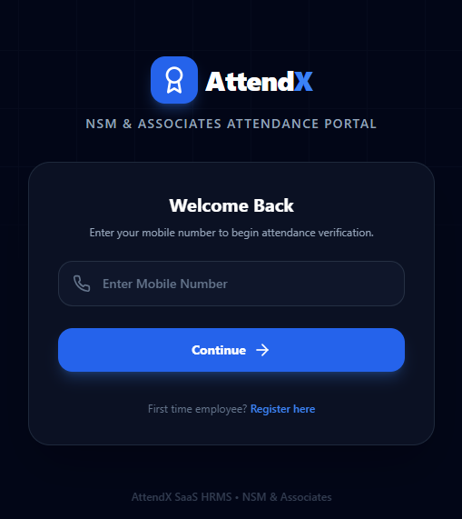

---

###  Employee Registration

Employee registration interface.

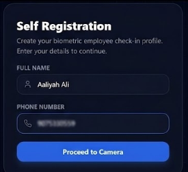

---

###  Employee Login

Login interface for registered employees.

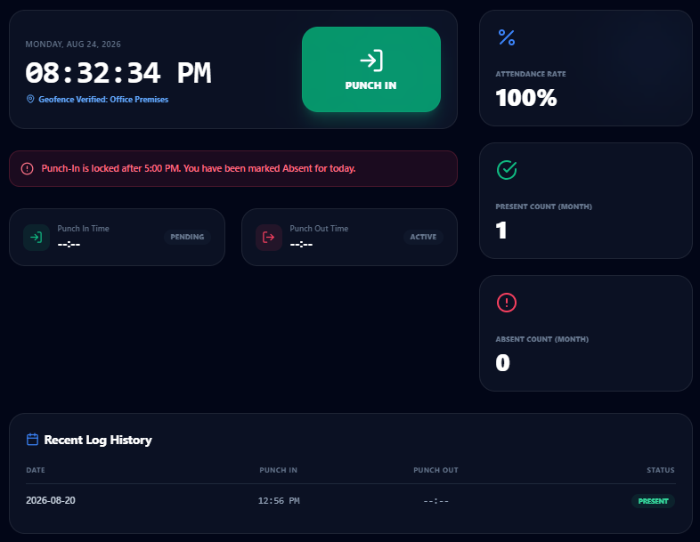

---

###  Face & Location Verification

Face and location verification before attendance.

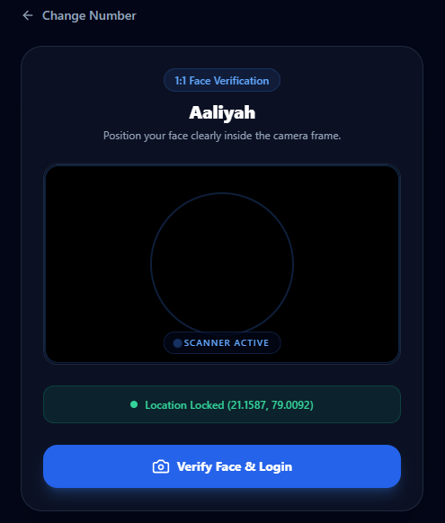

---

#  Admin Portal

###  Admin Login

Secure administrator login.

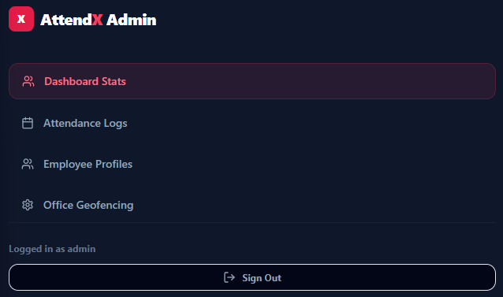

---

###  Admin Dashboard

Overview of attendance information.

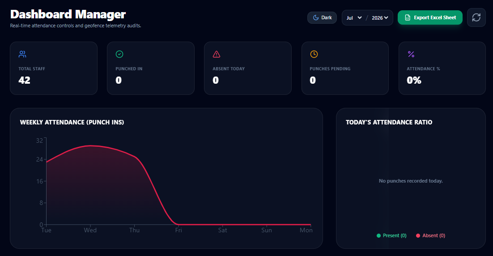

---

###  Employee Management

Manage registered employees.

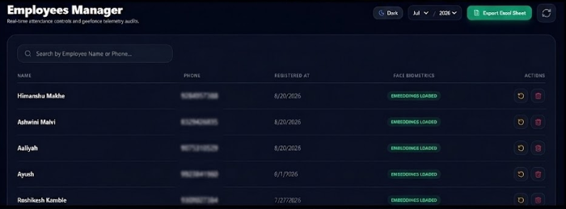

---

###  Attendance Logs

View employee attendance records.

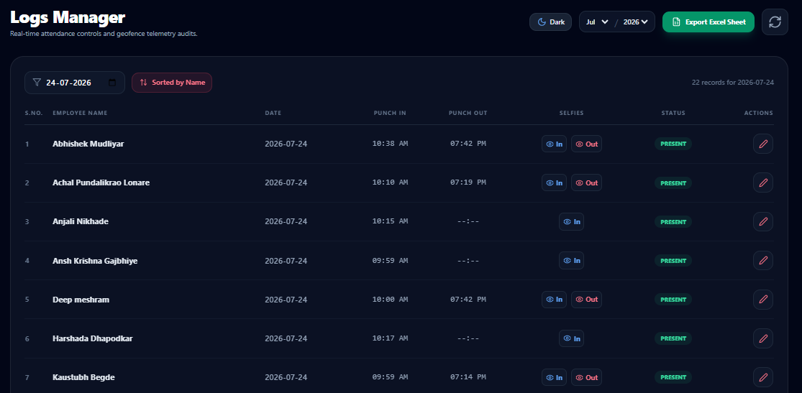

---

###  Geofence Settings

Configure the attendance location boundary.

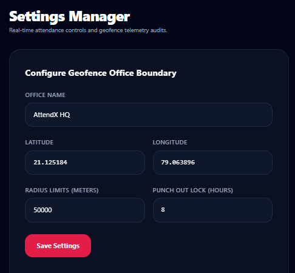

---

###  Verification Records

View attendance verification records.

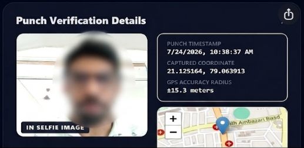

---

###  Excel Attendance Report

Exported attendance report.

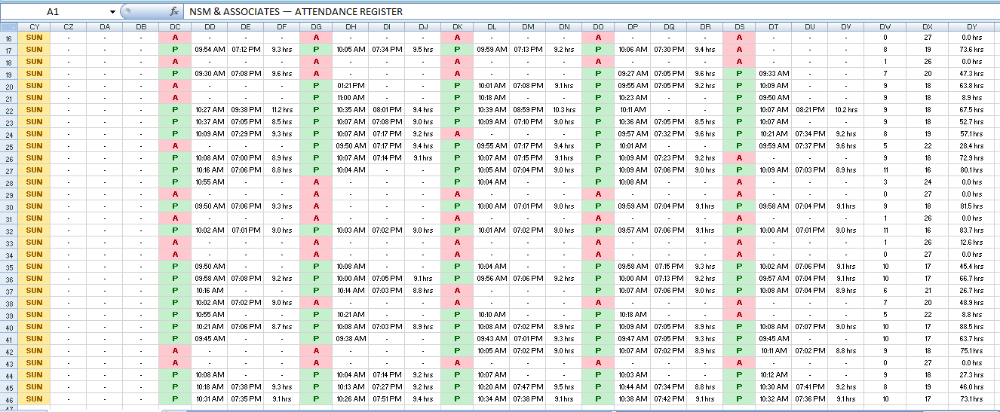


#  Technology Stack

| Layer             | Technologies                             |
| ----------------- | ---------------------------------------- |
| Frontend          | Next.js, React, TypeScript, Tailwind CSS |
| Backend           | Node.js, Express, TypeScript             |
| Database          | PostgreSQL, Prisma                       |
| Face Verification | Python, FastAPI, OpenCV                  |
| Authentication    | JWT, bcrypt                              |
| Reports           | ExcelJS                                  |
| Maps              | Leaflet                                  |

---

#  How AttendX Works

```text
Employee
   ↓
Authentication
   ↓
Face Verification
   ↓
Location Verification
   ↓
Attendance Recorded
   ↓
Admin Dashboard
   ↓
Attendance Reports
```

---

#  Security & Privacy

AttendX is designed with security and privacy in mind.

* Authentication-protected administrative functions
* Biometric verification for attendance
* Location validation
* Restricted administrative access
* Audit logging
* Secure environment-based configuration
* No sensitive credentials stored in the repository
 **Live Demo:** [attendx-frontend-eight.vercel.app](https://attendx-frontend-eight.vercel.app/)
